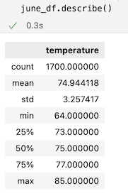
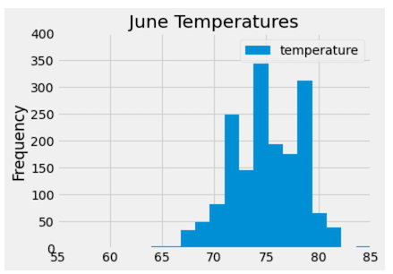
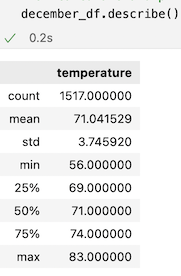
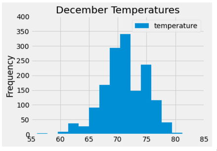
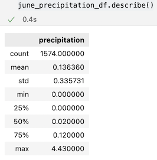
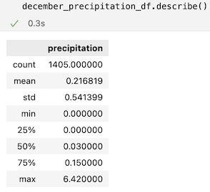

# surfs_up

## Statistical Analysis Overview

An investor interested in opening a surf and ice cream shop business in Oahu, wants to know 
information about Oahu' temperature trends. Specifically, he wants temperature data for the months of June and December in order to determine if the business would be sustainable year-round.

## Results

In order to gather the results SQLAlchemy was used to query the SQLite database, while Python's Matplotlib library was use to plot the temperatures.

### June Temperature Statistics

- The image bellow represents the summary statistics for the June temperature DataFrame (june_df).
    - Average temperature 75F
    - Minimun temperature 64F
    - Maximun temperature 85F

- The following chart shows the temperature frequency over the years during the month of June. It was separated into 15 different bins, and it can be seen that the frequency of temperatures was higher between 71F and 79F, which supports the average temperature of 75F found on the previous query (on the image above).

### December Temperature Statistics

- The following image shows the summary statistics for the December temperature DataFrame (december_df).
    - Average temperature 71F
    - Minimun temperature 56F
    - Maximun temperature 83F

- The following histogram shows the temperature frequency over the years during the month of December. It was separated into 15 different bins, and it can be seen that the frequency of temperatures was higher between 69F and 72F, which supports the average temperature of 71F found on the previous query (on the image above).

## Additional Results

In addition to the temperature for the months of June and December, another relevant data statistics that can help on the decision to open of not the shop, would be the amount of precipitation.

### June Precipitation Statistics

- The following image shows the summary statistics for the June precipitation DataFrame (june_precipitation_df).

    - Average precipitation 0.14 inches
    - Minimun precipitation 0 inches
    - Maximun precipitation 4.43 inches

### December Precipitation Statistics

- The following image shows the summary statistics for the December precipitation DataFrame (december_precipitation_df).

    - Average precipitation 0.22 inches
    - Minimun precipitation 0 inches
    - Maximun precipitation 6.42 inches

## Summary

After analyzing the results on the temperatures:
- Average temperature for the month of June was around 75F while for December the average was 71F, making it 5.3% cooler than June’s average. 
- The minimum temperature for June was 64F and for December was 56F, representing a difference of 12.5%.
- The maximum temperature for June was 85F while December was 83F, signifying just 2.4% lower than June.

The comparisons above indicates that although it can get a little cooler specially in December, still both months had relatively warm temperatures making the location a pretty good candidate for the opening of the business.

 When analyzing the precipitation results:
 - June's average was 0.14 inches while December was 0.22 inches, representing 36.4% more inches of rain compared to June which is not a significant difference considering that they are both lower than 1 inch of rain.
 - For both June and December the minimum amount of rain was 0.
 - June's maximum amount of precipitation was 4.43 inches while December was 6.42 inches, with an increase of 31% compared to June. 

The comparison above indicates that although there are days that it can rain a lot specially during December, both months had pretty low average amount of rain indicating that overall the weather is pretty stable for these months, with mostly light rain making it ideal for going surfing and eating ice cream.

